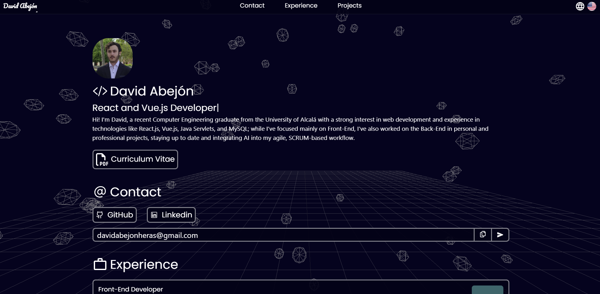
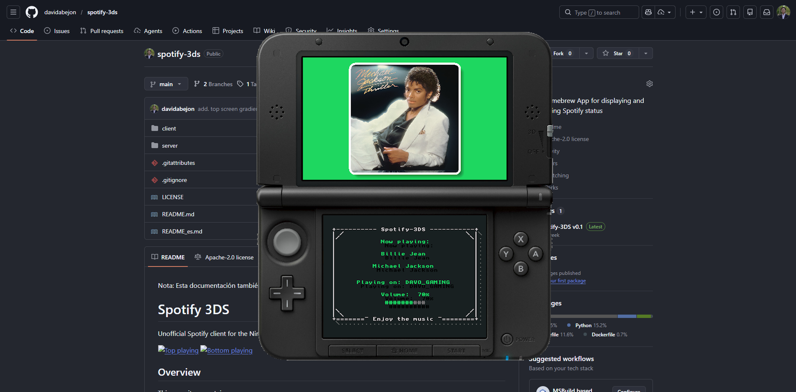
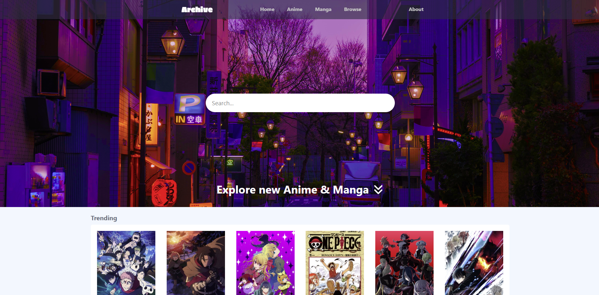

<p align="center">
  
</p>

## 🚀 About Me
```js
class SoftwareEngineer {
    constructor() {
        this.name = "David Abejón Heras";
        this.location = "Alcalá de Henares, Madrid";
        this.title = "Computer Engineer";
        this.specialty = "Full Stack Web Development";
    }
    
    stack() {
        return {
            frontEnd: ["React.js", "Vue.js", "Vite"],
            backEnd: ["Python", "FastAPI", "Java"],
            databases: ["MongoDB", "MariaDB", "MySQL"],
            methodologies: ["SCRUM", "Agile"]
        };
    }
    
    experience() {
        return ["Insurea", "Carrefour España", "Universidad de Alcalá"];
    }
    
    connect() {
        return {
            email: "davidabejonheras@gmail.com",
            linkedin: "linkedin.com/in/davidabejonheras",
            web: "davidabejon.cv"
        };
    }
}

const david = new SoftwareEngineer();
david.connect();
```


## ⭐ Highlighted Projects

## 
<table>
  <tr>
    <td width="50%" valign="top">
      <div align="center">
        <a href="https://github.com/davidabejon/portfolio" target="_blank">
          
        </a>
      </div>
      <h3 align="center">💻 Portfolio</h3>
      <p align="center">
        
        
        
      </p>
      <p align="center">A personal React-based portfolio featuring interactive 3D background to showcase projects and skills.</p>
      <div align="center">
        <a href="https://github.com/davidabejon/portfolio" target="_blank">
          
        </a>
      </div>
    </td>
    <td width="50%" valign="top">
      <div align="center">
        <a href="https://github.com/davidabejon/spotify-3ds" target="_blank">
          
        </a>
      </div>
      <h3 align="center">🎮 Spotify 3DS</h3>
      <p align="center">
        
        
        
      </p>
      <p align="center">A homebrew app that displays and controls Spotify playback on a Nintendo 3DS via a custom API backend/proxy.</p>
      <div align="center">
        <a href="https://github.com/davidabejon/spotify-3ds" target="_blank">
          
        </a>
      </div>
    </td>
  </tr>
  <tr>
    <td width="50%" valign="top">
      <div align="center">
        <a href="https://github.com/davidabejon/connected-sounds" target="_blank">
          
        </a>
      </div>
      <h3 align="center">🎵 Connected Sounds</h3>
      <p align="center">
        
        
        
      </p>
      <p align="center">A project to explore global radio broadcasts and connect cultures via live streams from stations around the world.</p>
      <div align="center">
        <a href="https://github.com/davidabejon/connected-sounds" target="_blank">
          
        </a>
      </div>
    </td>
    <td width="50%" valign="top">
      <div align="center">
        <a href="https://github.com/davidabejon/archive" target="_blank">
          
        </a>
      </div>
      <h3 align="center">📺 Archive</h3>
      <p align="center">
        
        
        
      </p>
      <p align="center">Educational frontend recreation of Anilist using React.js powered by the Anilist API.</p>
      <div align="center">
        <a href="https://github.com/davidabejon/archive" target="_blank">
          
        </a>
      </div>
    </td>
  </tr>
</table>

## 🛠️ Tech Stack

### Programming Languages


### Web Technologies


### Databases


### Tools


## 📊 GitHub Activity

<div align="center">
  
</div>

<div align="center">
  
  
</div>

<div align="center">
  
  
</div>

<p align="center">
  
</p>

<p align="center">
  
</p>

## 📩 Contact me

###  Discord


[](https://discordapp.com/users/326021063496433666/)
